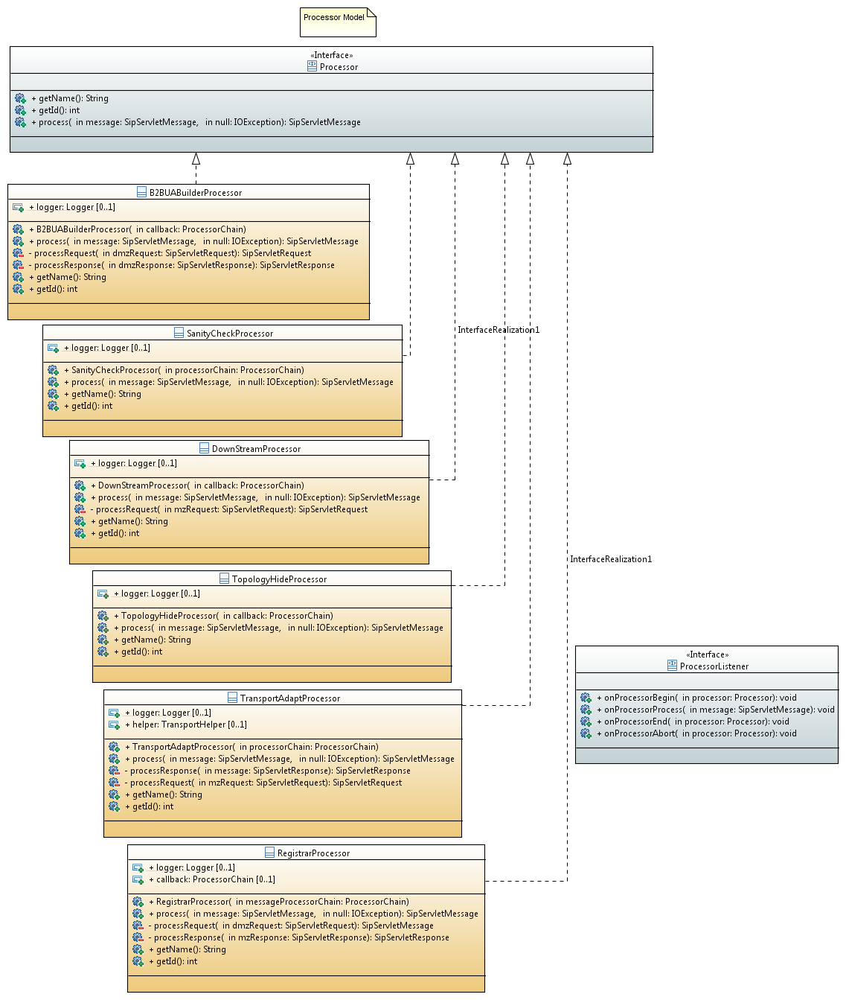

== The Chain Sub-system Framework

=== What is it & what's for?

An SBC is a machine designed to be in the middle of a transmission flow pipe in order to intercept, analyze and eventually mangle, transform or drop some traffic packets targeted to a certain destination, usually a VoIP insecure SIP Proxy/Server.

This process accepts packet flow from an input source and delivers packets to an output destination based on some certain filtering rules implemented at the business rule layer.

In order to perform such piping mechanism, we have to take into account some operational rules that have to be followed to be up to the needs of traffic management issue and its further analysis, until the input data could reach the output side of what we will call the _chain subsystem_.

The chain subsystem is an entity responsible of chaining _processor modules_, control their life-cycle and execution priority and delivering of the processor output to the next electable module in the chain until all modules are traversed or one of the modules reject the packet.

Let's see the anatomy of the chain subsystem:

* Messages
** Mutables Messages
** Immutable Messages
* Processor Units
** Chains
*** Serial flow chains
*** Parallel flow chains
** R/W Processors
** DPI Processors

We will perform a deep insight of the _chain subsystem_ design model in order to understand each entity's role and the ineraction between them.

=== The Message

Let's consider a _message_ as a discrete bunch of data that reaches the chain input;
the same way as a packet is the atomic view of the OSI TCP/IP protocol stack.

In the chain subsystem abstraction, the message could be any arbitrary data classified in two kinds of content:

* Immutable content
* Mutable content

=== Immutable messages
_Immutable messages_ are those sort of messages that, for its very nature, will not be altered in content by any processor in the chain flow process.
They are usually messages that have to be sniffed by some processors in the chain, looking for certain patterns in order to perform some action based in its content, but won't be any need to change them.

=== Mutable messages
_Mutable messages_ are those read-write messages that will be manipulated by processors in the chain in order to alter their content based on certain rules before they reach the chain output.

[TIP]
====
An _Immutable message_ version of a _Mutable message_ can be obtained from the _Mutable_ object at run-time via Mutable.getImmutable().
====

=== The Message Processor Unit (MPU)

An MPU is a module responsible of taking an incoming message, process it, and return a processed message. The rules the MPU module use to transform the message are only related to its inner logic.

.Message Processor Unit
[ditaa,mpu,png]
--

           +------------------+
           |                  |
           |                  |
---------> +       MPU        + --------->      
 Message   |                  |  Message
           |              {d} |
           +------------------+
                    
                    
--

From Java perspective:

.Processor.java
[source,java]
----
public interface Processor {
	
	enum Status {
		IDLE,
		PROCESSING,
		TERMINATED,
		ABORTED
	}
	
	enum Type {
		CHAIN,
		SINGLE_PROCESSOR
	}
	
	/**
	 * Gets name
	 * 
	 * @return name
	 */
	Status getStatus();
	
	/**
	 * Gets type
	 * 
	 * @return type
	 */
	Type getType();
	
	/**
	 * Gets name
	 * 
	 * @return name
	 */
	String getName();
	
	/**
	 * Sets name
	 * 
	 * @return name
	 */
	void setName(String name);
	
	/**
	 * Gets id
	 * 
	 * @return id
	 */
	int getId();
	
	/**
	 * EventListeners
	 * @param listener
	 */
	void addProcessorListener(ProcessorListener listener);
	
	/**
	 * Processes the message
	 * 
	 * @param message
	 * @throws IOException
	 * @return message
	 */
	
	void process(MutableMessage message) throws ProcessorParsingException;
	
	/**
	 * Gets a reference of the processor
	 * 
	 * @return callback
	 */
	ProcessorCallBack getCallback();	
	
}
----

_Processors_ are the core entities of the chain subsystem.

[TIP]
====
Looking at figure #1 we can see that almost every active component of the chain subsystem is, by its very nature, a _Processor_. _Chains_ themselves are special processors specialized in chaining other _Processor_ components together to control its execution flow relationship.
====

We can figure out some specialized Message Processors, each of them to be responsible of one process at a time:

=== The Message Transport Adapter (MTA)

An MTA is a module responsible of taking an incoming message carried by certain transport (TCP/UDP etc), and dispatch it out over another transport protocol acting as a transport gateway adapter.

.Message Transport Adapter
[ditaa,mta,png]
--

           +------------------+
           |                  |
           |                  |
---------> +       MTA        + --------->      
 Message   |                  |  Message
   TCP     |              {d} |   UDP
           +------------------+
                    
                    
--

From Java perspective:

.TransportAdapter.java
[source,java]
----
public interface TransportAdapter {
	
	/**
	 * TransportAdapter must be implemented for those transport
	 * specialized convertors to forward messages between them-
	 */
	
	/**
	 * Message adaptation service
	 * @param message
	 * @return adapted message to target transport
	 */
	SipServletMessage adapt(SipServletMessage message);

}
----

TAs may be embedded into MPUs in order to be called statically or dynamically from Transport factories to build, for instance, a generalized TransportAdaptProcessor responsible to deal with all possible Transport adaptions.

=== Chains

A _Chain_ is the uppermost container of the Message traffic flow. A _chain_ is a _Processor_ responsible to drive traffic from input to output through its inner components to the destination target.

.ProccesorChain.java
[source,java]
----
public interface ProcessorChain extends Processor {
	
	/**
	 * Gets next Message processor in the chain
	 * 
	 * @return nextInChain
	 */
	Processor getNextLink(Processor processor);
	
	/**
	 * unlinks from the chain
	 * breaking its prefixed sequence
	 * causing immediate message process
	 * termination. 
	 */
	
	void unlink(Processor processor);
	
}
----

Two kinds of _chains_ exists in the chain subsystem:

* Serial chains
* Parallel chains

=== Serial chains
_Serial chains_ are sorts of chains designed to perform a sequential execution of _Processors_ of its ownership. The act of adding a _Processor_ to a _Chain_ ownership is called "_linking_". The linking order at the instance creation time determines the Processor's precedence in the sequence.

.SimpleSerialProcessChain.java
[source,java]
----
...
public SimpleSerialProcessChain() {
		setName("SSPC");
		// initialize the chain
		// works with original message
		Processor c1 = new SimpleProcessor("c1", this);
		Processor c2 = new SimpleProcessor("c2", this);
		Processor c3 = new SimpleProcessor("c3", this);
		Processor c4 = new SimpleProcessor("c4", this);
		
		
		// set the chain of responsibility
		
		try {
			link(c1, c2);   //Processor c1 is the start point of the chain
			                //Processor c2 is the next execution point
			link(c2, c3);   //Processor c3 is executed after c2 terminates
			link(c3, c4);
			link(c4, new DispatchProcessor("Dispatch", this));
		} catch (MalformedProcessorChainException e) {
			// TODO Auto-generated catch block
			e.printStackTrace();
		}
}
...
		
----

[TIP]
====
A _Serial chain_ is the optimal entity to implement the main backbone chain.
====

As the inner processors linked in a serial chain are executed sequentially, each processor would be able to deal with the message in a read-write mode without the need to make any further synchronization of the message content. This way, _Serial Chains_ are designed to interact with any kind of mutable or immutable messages.

.SerialProcessChain.java
[source,java]
----
public interface SerialProcessorChain extends ProcessorChain {
	
	/**
	 * Sets next Processor in the chain
	 * 
	 * @param nextInChain
	 */
	void link(Processor processor,
	          Processor nextInChain) throws MalformedProcessorChainException;
	
}
----

=== Parallel Chains
_Parallel Chains_ are designed to execute Processors in parallel or _concurrent_ mode.
Processors *are not sequenced* and they process the incoming message in a separate processor thread at the same time. This kind of chains fits better in a message sniffing scenario, where the processors of its ownership just have to deep inspect the message content in order to determine further actions, without the need to make a message transformation.

.ParallelProcessChain.java
[source,java]
----
public interface ParallelProcessorChain extends ProcessorChain {
		
	
	/**
	 * adds Processor to the chain
	 * 
	 * @param processor
	 */
	void link(Processor processor) throws MalformedProcessorChainException ;
	
	/**
	 * adds next hop Processor to the chain
	 * 
	 * @param processor
	 */
	void setNextLink(Processor processor) throws MalformedProcessorChainException ;
	
}
----

=== Read-Write Processors

As _chains_ are indeed truely _Processors_, in the concept that they accepts input messages and produce output messages, we call them chains in order to qualify its role in the full process flow.

_R/W Processors_  are special _Processors_ in charge of making a certain transformation of the incoming message, based usually in a small set of rules.

[TIP]
====
The chain subsystem is designed keeping in mind the _kis design model (Keep It Simple Pattern)_ ., this way, _Processors_, while not mandatory, *might* have to implement simple atomic rules, separating complex rules in different processors. It is part of the Best practice rules while implementing new processors. Implementing a specialized transformation rule by processor keep code clean and easy maintainable, enlarging full code life-cycle.
====

=== The DPI (Deep Packet Inspector) Processors

_DPI Processors_ are processors typically owned by _Parallel chains_ specialized in dealing with _Immutable messages_.

_Deep Packet Inspectors_ are software entities implemented by sniffers in order to dig in a message content to find a certain pattern occurrence and take an action based on that. They *do not transform* the message content but *inspect* its content instead in read-only/immutable mode.

=== Linking and unlinking a Process

A Processor is linked to the chain at chain design time. If there is no rule violation all the path down to the output, the whole chain is traversed until it reaches the end.

If the output of a chain is linked to another chain (of any kind), the message keep on flowing through its inner logic again.

If everything is consistent with the implemented business logic in all processors that the chains traverses and we reach the output of the last subchain or processor linked the the main backbone chain, the complete cycle of the chain is over.

If any Processor in any chain find a rule violation to its logic contract, it is able to ask the chain to be unlinked and enforce the interruption of the processing flow causing an immediate termination of the chain and the complete cycle of the chain is over.

====
[CAUTION]
On an SBC SIP Servlet Request Response scenario, messages ends up on a _send_ operation. This action feeds the message to the underlaying Servlet system for dispatching.
It is a good practice to always terminate the backbone chain in a dispatcher processor whose role is just to dispatch the message.
====

=== Complex chain design Scenario

.Complex Chain
[ditaa,complexchain,png]
--
             +-------------------------------------+
             |     Serial Chain Backbone           |
             |  +------------------------------+   |
             |  |                              |   | unlink
             |  |  P1--> P2--> P3--> P4--> P5  +-+-|------+
             |  |  Serial Chain                | | |      |
             |  +------------------------------+ | |      |
             |                  +----------------+ |      |
             |                  |     link         |      |
             |                  v                  |      |
             |  +---------------+--------------+   |      |
             |  |                              |   |      |
             |  |              P6              +-+-|----+ |
             |  |  Single Processor            | | |    | |
             |  +------------------------------+ | |    | |
             |                  +----------------+ |    | |
             |                  |     link         |    | |
             |                  v                  |    | |
             |  +---------------+--------------+   |    | |
             |  |        P7.1  P7.2  P7.3      |   |    | |
             |  |                              |   |    | |
             |  |          |    |     |        |   |    | |
             |  |          v    v     v        +---|--+ | |
             |  |  Parallel Chain              |   |  | | |
             |  +---------------+--------------+   |  | | |
             |                  |                  |  | | |
             |                  |     link         |  | | |
             |                  v                  |  | | |
             |  +---------------+--------------+<--|--+ | |
             |  |      Dispatch  Processor     |<--|----+ |
             |  +------------------------------+<--|------+
             +-------------------------------------+
              
--

== Implementing a Single Processor Example

All single _Processors_ MUST extend _DefaultProcessor_ class implementation and, at least, implements the _ProcessorCallBack_ interface.

The _DefaultProcessor_ class is the core model implementation of all processors in the chain subsystem. It hides all main complexities of the _Processor_ creation and is responsible of notifiying the Processor acivity to the _View_ layer of the MVC abstraction.

The _ProcessorCallBack_ interface implemented by the processor gives to the _DefaulProcessor_ a handle to the _doProcess()_ method in the particular processor.

The _doProcess()_ method will be in charge of all the business logic of the _Processor_ implementation.

Let's think about an SBC rule willing to prohibit all SIP messages coming from DMZ zone becoming from a User Agent entitled as _Bad-Guy_.

We will implement a DPI Processor in order to drop the message as soon as we detect its fingerprint on it.

[NOTE]
====
While this kind of rule may work sometimes, a more complex implementation has to be done in order to analyze the User Agent fingerprint other than its User-Agent nomination.
Usually doing a mix of the User-Agent name, tag pattern format and SIP MESSAGE capabilities sort order could give us a better understanding of the User agent SIP stack that is originating the threat message.
====

.DPIUserAgentACLProcessor.java
[source,java]
----
package org.restcomm.sbc.chain.processor.impl;

import javax.servlet.sip.SipServletMessage;
import org.apache.log4j.Logger;
import org.restcomm.chain.ProcessorChain;
import org.restcomm.chain.processor.ProcessorCallBack;
import org.restcomm.chain.processor.impl.DefaultProcessor;
import org.restcomm.chain.processor.impl.ProcessorParsingException;

/**
 * 
 * @author  Oscar Andres Carriles <ocarriles@eolos.la>
 * @date    25/4/2016 9:54:10
 * @class   DPIUserAgentACLProcessor.java
 */
/**
 * Specialized Message Processor responsible to check grammar and syntax
 * health of the UAC incoming sip message. 
 *
 */
public class DPIUserAgentACLProcessor extends DefaultDPIProcessor implements ProcessorCallBack {

	private String name="Simple ACL UA Processor";
	
	private static transient Logger LOG = Logger.getLogger(DPIUserAgentACLProcessor.class);

	private ProcessorChain chain;
	
	public DPIUserAgentACLProcessor(ProcessorChain processorChain) {
			super(processorChain);
			chain=processorChain;
	}
	
	public DPIUserAgentACLProcessor(String name, ProcessorChain processorChain) {
			super(name, processorChain);
			chain=processorChain;
	}

	public String getName() {
		return name;
	}

	public int getId() {
		return this.hashCode();
	}

	public SipServletMessage doProcess(SipServletMessage message) throws ProcessorParsingException {
		if(LOG.isTraceEnabled()){
	          LOG.trace(">> doProcess()");
	    }	
		String userAgent=message.getHeader("User-Agent");
		if (userAgent.contains("Bad-Guy")) {
			chain.unlink(this);
			
		}
		return message;
	}

	@Override
	public void setName(String name) {
		this.name=name;
	}

	@Override
	public ProcessorCallBack getCallback() {
		return this;
	}

	@Override
	public void doProcess(Message message) throws ProcessorParsingException {
		doProcess((SipServletMessage)message.getWrappedObject());
	}

}
----
