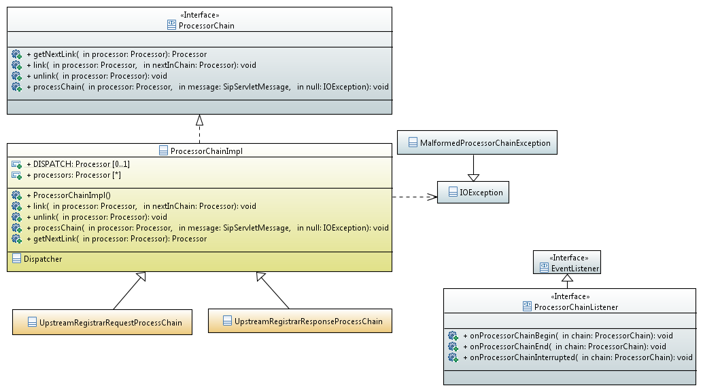

== The Chain of Responsibility Model

An SBC could be thought as a chain of MPUs that must be traversed downstream,
applying a set of security rules and filters and upstream, applying some sets of transformation rules. Different sort of chains must deal with upstreaming flow than those regarding the downstream direction.
Some messages coming in upstream direction must not traverse the B2BUA MPU and must be rejected directly to the sender with certain failed status due to not being compliant to certain processing rule in a prior MPU of the upstraming chain.

.Processor Chain
[ditaa,processor-chain,png]
--
                              
        +--------+       +--------+        +--------+
        | MPU    |       | MPU    |        | MPU    |
        |        |  link |        | link   |        |
------> + First  |------>| Next   + ------>+ Last   | ------->
Message |        |       |        |        |        |  Message
        |     {d}|       |     {d}|        |     {d}|
        +--------+       +--------+        +--------+
           
                    
--

In terms of UML design:

---

In terms of the Java abstraction:

.ProcessorChain.java
[source,java]
----
/**
 * A ProcessorChain is a component of a chain of responsibility
 * responsible in the construction of the chain of Processors
 * that will interact in the transformation of the message.
 * it enqueues processors and controls the chain life-cycle.
 */
 
public interface ProcessorChain extends Processor {
	
	
	/**
	 * Gets next Message processor in the chain
	 * 
	 * @return nextInChain
	 */
	Processor getNextLink(Processor processor);
	
	
	
	/**
	 * unlinks from the chain
	 * breaking its prefixed sequence
	 * causing immediate message process
	 * termination. 
	 */
	
	void unlink(Processor processor);
	
	
	
}
----

This kind of Processors chain is by its very nature a serial sequential chain, one-to-one relationship could be stablished between processors in the chain, has one start-point and one end-point of execution.
MPUs can request flow execution interrupt to the chain in order to produce
further abort of the next point of execution by unlinking the next MPU.

.Interrupt Processor Chain
[ditaa,processor-chain-unlinked,png]
--
                              
        +--------+       +--------+        +--------+
        | MPU    |       | MPU    |        | MPU    |
        |        |  link |        | unlink |        |
------> + First  |------>| Next   + ---x-+ | Last   |  
Message |        |       |        |      | |        |   
        |     {d}|       |     {d}|      | |     {d}|
        +--------+       +--------+      | +--------+
                                         |       Message
                                         +------------------->
                                  
--

Such a way In terms of the Java implementation we can think of two different kind of chains to be applied to a SIP REGISTER session designed to deal with Request and Response direction of the message flow:

.UpstreamRegistrarRequestProcessChain.java
[source,java]
----
public class UpstreamRegistrarRequestProcessChain extends DefaultSerialProcessorChain implements ProcessorCallBack {

	

	public UpstreamRegistrarRequestProcessChain() {
		
		// initialize the chain
		// works with original message
		Processor c1 = new SanityCheckProcessor(this);
		Processor c2 = new RegistrarProcessor(this);
		Processor c3 = new B2BUABuilderProcessor(this);
		// works with B2BUA Leg message
		Processor c4 = new TransportAdaptProcessor(this);
		
		
		// set the chain of responsibility
		
		try {
			link(c1, c2);
			link(c2, c3);
			link(c3, c4);
			link(c4, new DispatchProcessor("Dispatch", this));
		} catch (MalformedProcessorChainException e) {
			LOG.error("ERROR",e);
		}
		
		
		
	}
	public SipServletMessage doProcess(SipServletMessage message) {
		return message;
	
	}
	
	@Override
	public String getName() {
		return name;
	}
	@Override
	public void setName(String name) {
		this.name=name;
		
	}
	@Override
	public ProcessorCallBack getCallback() {
		return this;
	}
	@Override
	public Object doProcess(Object message) throws ProcessorParsingException {
		return doProcess((SipServletMessage)message);
	}
	

}
----

.UpstreamRegistrarResponseProcessChain.java
[source,java]
----
public class UpstreamRegistrarResponseProcessChain extends DefaultSerialProcessorChain implements ProcessorCallBack {

	
	public UpstreamRegistrarResponseProcessChain() {
		// initialize the chain
		// works with original message
		Processor c1 = new RegistrarProcessor(this);
		Processor c2 = new B2BUABuilderProcessor(this);
		// works with B2BUA Leg message
		Processor c3 = new TopologyHideProcessor(this);
		
		// set the chain of responsibility
		try {
			link(c1, c2);
			link(c2, c3);
			link(c3, new DispatchProcessor("Dispatch", this));
		} catch (MalformedProcessorChainException e) {
		    LOG.error("ERROR",e);
		}
		
	}

	@Override
	public String getName() {
		return name;
	}

	@Override
	public void setName(String name) {
		this.name=name;
		
	}

	@Override
	public ProcessorCallBack getCallback() {
		return this;
	}

	public SipServletMessage doProcess(SipServletMessage message) throws ProcessorParsingException {
		return message;
	}

	@Override
	public Object doProcess(Object message) throws ProcessorParsingException {
		return doProcess((SipServletMessage)message);
	}

	
}
----
