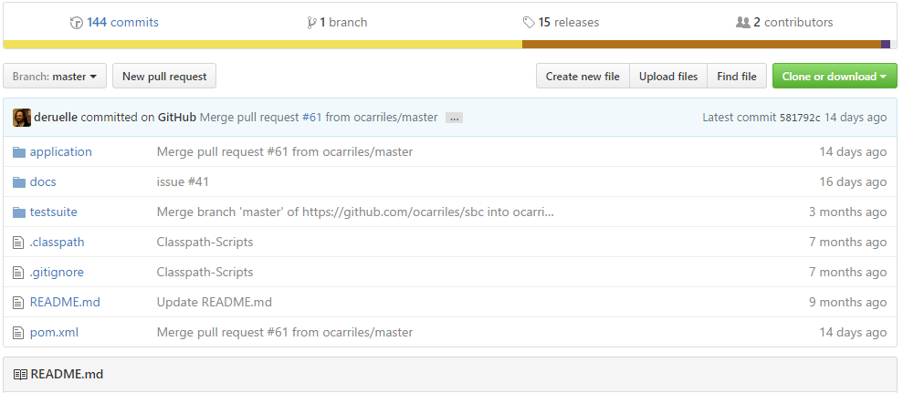
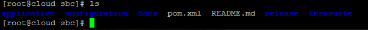
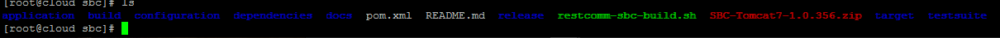

[[build-from-source]]
= How to build Restcomm-SBC from source

== Requirements

* You must have link:https://git-scm.com/book/en/v2/Getting-Started-Installing-Git[git] installed on your computer
* You must have link:http://ant.apache.org/manual/install.html[ant] installed on your computer
* You must have link:http://www.oracle.com/technetwork/java/javase/downloads/jdk7-downloads-1880260.html[JDK - 7] installed on your computer
* You must be running link:https://maven.apache.org/download.cgi[maven] version 3.x.x on your computer

== Obtaining git URL

* Go to  https://github.com/RestComm/sbc.git
You will see the page like this one below. Copy the URL in the *HTTPS* field.
The URL should look like this: https://github.com/RestComm/sbc.git

== Restcomm-SBC cloning

In the bash window of your local computer create a directory where you should clone Restcomm-SBC:

* run the command :

[source,bash]
----
git clone https://github.com/RestComm/sbc.git
----
This command will create a new directory called sbc. Go to this directory entering the command:

[source,bash]
----
 cd sbc
----

The content of the directory should contain the following:

== Restcomm-SBC building

* You will need to create a script to build Restcomm-SBC.
Copy the script below into a bash script on your local directory at the root of the RestComm-SBC.
In this tutorial, the script below is stored in the file *restcomm-sbc-build.sh*.

[source,bash]
----
#!/bin/bash
export SBC_HOME=/root/sbc
export MAJOR_VERSION_NUMBER=1.0
export BUILD_NUMBER=356

export WORKSPACE=$SBC_HOME
mkdir $WORKSPACE/dependencies
export DEPENDENCIES_HOME=$WORKSPACE/dependencies

ant release -f ./release/build.xml -Dsbc.release.version=$MAJOR_VERSION_NUMBER.$BUILD_NUMBER -Dsbc.branch.name=sbc-release-$MAJOR_VERSION_NUMBER.$BUILD_NUMBER -Dcheckout.sbc.dir=$SBC_HOME -Dworkspace.sbc.dir=$SBC_HOME -Dcheckout.dir=$DEPENDENCIES_HOME

----

* Change the restcomm-sbc-build.sh permission to make it executable as follows

[source,bash]
----
chmod +x ./restcomm-sbc-build.sh
----

* Now, run the build script as follows:
[source,bash]
----
./restcomm-sbc-build.sh
----

This may take a while to build. If the build is successful, you should see this output at the end of the build:

[source,bash]
----

make-final-zip:
      [zip] Building zip: /root/sbc/SBC-Tomcat7-1.0.356.zip

release:

BUILD SUCCESSFUL
Total time: 1 minute 46 seconds

----
* At the root of the SBC directory you should see:

Note that the zip file called *SBC-Tomcat7-1.0.356.zip* is the binary for Tomcat container.
You can copy this zip file into a directory on your computer and unzip the content.

Here you can read the detailed information on <<Starting   SBC.adoc#configure-restcomm-iP-information-and-text-to-speech,Starting Restcomm-SBC>>.
