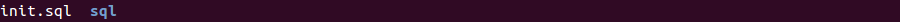
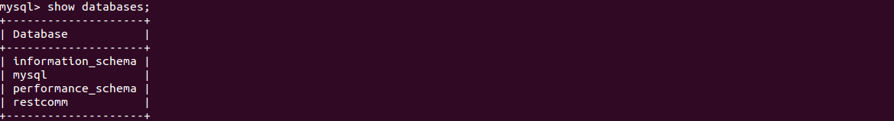

[[restcomm-connect-mysql]]
= How to get started with Restcomm-SBC and Mysql

_When working with the binary version of SBC, the default database is hsqlDB.
This is of course not suitable for production but it is provided as a way for you
to conveniently and quickly start up SBC.
For those who would like to run SBC on a local server or on another cloud based system,
the following tutorial will show how to get started with SBC and Mysql._

== Requirements

* Install SBC using our <<How to build Restcomm-SBC from source.adoc#requirements,previous guide>>.
* Install link:http://dev.mysql.com/doc/refman/5.7/en/installing.html[MySQL]

== Configuring the mybatis.xml file to use Mysql
* Go to the *$SBC_HOME/webapps/restcomm-sbc/WEB-INF/conf/* directory.
 Open the *mybatis.xml*. $SBC_HOME is conventional name for unzipped *SBC-Tomcat-1.0.0* directory.

* Add the Mysql configuration environment tag as shown below.
Make sure that you have indicated the correct MySQL username, password
and IP of the computer where the database is located (it is 192.168.0.2 in the example).

[source,bash]
----
<dataSource type="POOLED">
        <property name="driver" value="com.mysql.jdbc.Driver"/>
        <property name="url" value="jdbc:mysql://192.168.0.2/sbc"/>
        <property name="username" value="YourUser"/>
        <property name="password" value="YourPass"/>
</dataSource>

----
* Save and exit the mybatis.xml file.

== Start Mysql and Create the Restcomm database

* Start Mysql by running the command

[source,bash]
----
sudo /etc/init.d/mysql start
----

Or use link:http://dev.mysql.com/doc/refman/5.7/en/windows-start-command-line.html[MySQL guide].

* Go to the *$SBC_HOME/webapps/restcomm-sbc/WEB-INF/scripts/mariadb* directory. There will be the *init.sql* file and *sql* directory:

* Create the SBC database running the following command:

[source,bash]
----
mysql -u root -p < init.sql
----
* Log into Mysql and make sure the SBC database was created by running the command:

[source,bash]
----
show databases;
----
If the process was successful you will see the following:

== Edit the sbc.xml file to point the DAO to MySQL

* Go to the *$SBC_HOME/webapps/restcomm-sbc/WEB-INF/conf/*.
Open the *sbc.xml* file.
* Find the dao-manager tag and change the sql-files path to mariadb as shown below:

[source,bash]
----
<dao-manager class="org.restcomm.sbc.dao.mybatis.MybatisDaoManager">
    <configuration-file>${sbc:home}/WEB-INF/conf/mybatis.xml
    </configuration-file>
    <data-files>${sbc:home}/WEB-INF/data/hsql</data-files>
    <sql-files>${sbc:home}/WEB-INF/sql</sql-files>
</dao-manager>

----
== Download Mysql Java Client Driver

* Download the latest *MySQL Java Connector* from http://mvnrepository.com/artifact/mysql/mysql-connector-java.
* Put the jar file in
*$SBC_HOME/webapps/restcomm-sbc/WEB-INF/lib/*.

* Go to the $SBC_HOME/bin/ directory.

== Verify the setup was successful

* In order to verify the setup was correctly done, first you have to start SBC running the following command:

[source,bash]
----
./catalina.sh start
----

* Open your web browser and go to the url – https://IP:8443. Instead of "IP" you should put your IP.

* Log in with the administrator@company.com username and the SBC password. Then you should change the default password.
If you have changed the default password before, you should insert your own password at once.

Here you can read the detailed information on <<Starting SBC.adoc#configure-restcomm-iP-information,Starting Restcomm-SBC>>.
