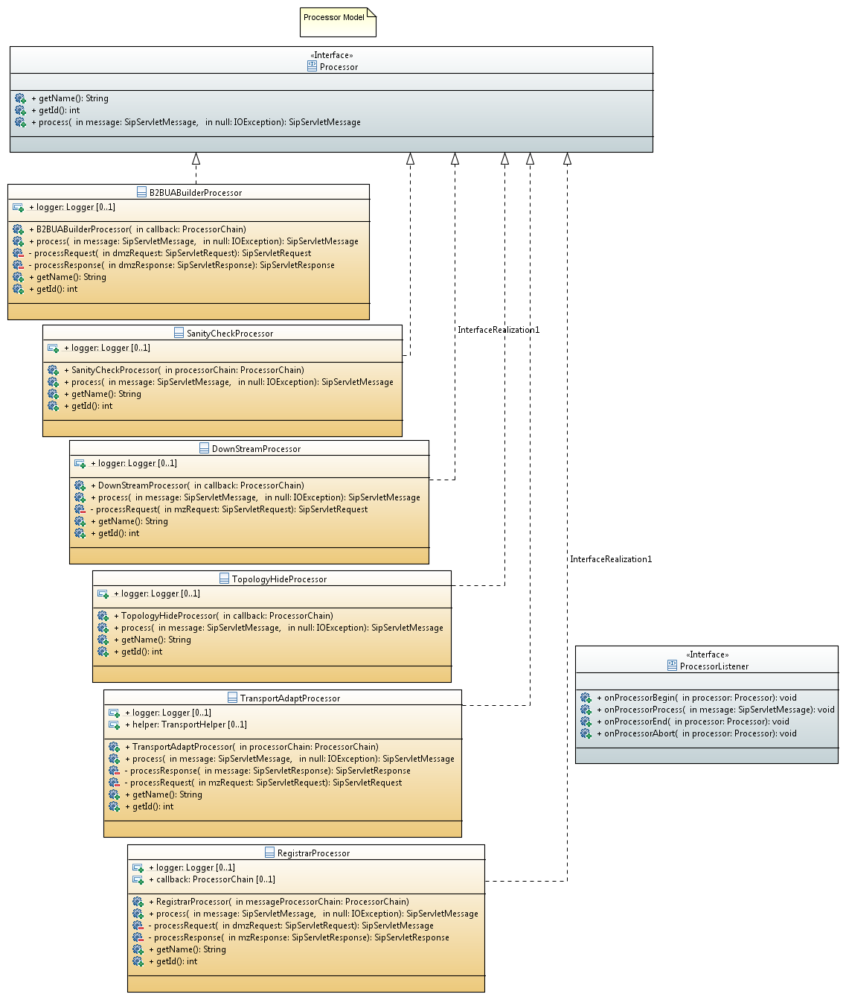

== Introduction

A Session Border Controller is a security device responsible to filter unwanted session stablishment from unstrusted networks and let this traffic flow to internal networks based on a bunch of security rules.

== Message flow in SBC topology

    UA     User Agent
    MPU    Message Processor Unit
    MTA    Message Transport Adapter
    B2BUA  Back to Back User Agent
    MZ     Miltarized Zone (LAN)
    DMZ    Demilitarized Zone (WAN)
    SBC    Session Border Controller

.SBC Message flow
[ditaa,images/sbc,png]
--
  

				DOWNSTREAM------------->
                                     
                                            |-----TO Militarized Zone-->
                           SBC              |
                           +----------------+-----------------+                  +---------+
    +----+                 | +------+   +---+---+   +---+---+ |                  |         |
    |    +---DMZ Request-->+ |      |   |   |   |   |   |   | +<---MZ Request----+ PROXY   |
    | UA |                 | |  MPU |   | B2BUA |   |MTA|MPU| |                  | SERVER  |
    |    +<--DMZ Response--+ |      |   |   |   |   |   |   | +----MZ Response-->+         |
    +----+                 | +------+   +---+---+   +---+---+ |                  |         |
                           +----------------+-----------------+                  +---------+
                                            |
               <--To Demilitarized Zone-----|
               
               			<---------------UPSTREAM
               						
 
    
--

Figure 1 shows the basic arquitectural components of an SBC together with some references related to information flow. On Request/Response scenarios such as HTTP, SIP, etc., traffic flow is always bidirectional. A request in one direction is replied by a Response to the Request originator. The conventions of this book will treat traffic flow direction from the Request viewpoint:

Downstream traffic is the traffic coming to the SBC from the untrusted network WAN (Normally from a User Agent endpoint) asking for VoiP service on Proxy/Server backend.
Upstream traffic is the traffic coming to the SBC from the trusted network LAN delivering service from Proxy/Server to user agent endpoints.

In this way we can think of traffic flow as comming from a *Militarized Zone* (MZ) behind the security border we stablish with the SBC to a *De-Militarized Zone* (DMZ) and viceversa. It is the same concept of *Border* stablished by a Firewall device at the TCP/IP layers but, in this particular case, related to higher level VoIP traffic.

=== The Message Processor Unit (MPU)

An MPU is a module responsible of taking an incoming message, process it, and return a processed message. The rules the MPU module use to transform the message are only related to its inner logic.

.Message Processor Unit
[ditaa,images/mpu,png]
--

           +------------------+
           |                  |
           |                  |
---------> +       MPU        + --------->      
 Message   |                  |  Message
           |              {d} |
           +------------------+
                    
                    
--
From Java perspective:

.Processor.java
[source,java]
----
public interface Processor {
	
	/**
	 * Gets name
	 * 
	 * @return name
	 */
	String getName();
	
	/**
	 * Gets id
	 * 
	 * @return id
	 */
	int getId();

	/**
	 * Processes the message
	 * 
	 * @param message
	 * @throws ProcessorParsingException
	 * @return message
	 */
	
	SipServletMessage process(SipServletMessage message) throws ProcessorParsingException;

}
----
We can figure out some specialized Message Processors, each of them to be responsible of one process at a time:

=== The Message Transport Adapter (MTA)

An MTA is a module responsible of taking an incoming message carried by certain transport (TCP/UDP etc), and dispatch it out over another transport protocol acting as a transport gateway adapter.

.Message Transport Adapter
[ditaa,images/mta,png]
--

           +------------------+
           |                  |
           |                  |
---------> +       MTA        + --------->      
 Message   |                  |  Message
   TCP     |              {d} |   UDP
           +------------------+
                    
                    
--

From Java perspective:

.TransportAdapter.java
[source,java]
----
public interface TransportAdapter {
	
	/**
	 * TransportAdapter must be implemented for those transport
	 * specialized convertors to forward messages between them-
	 */
	
	/**
	 * Message adaptation service
	 * @param message
	 * @return adapted message to target transport
	 */
	SipServletMessage adapt(SipServletMessage message);

}
----

TAs may be embedded into MPUs in order to be called statically or dynamically from Transport factories to build, for instance, a generalized TransportAdaptProcessor responsible to deal with all possible Transport adaptions.
